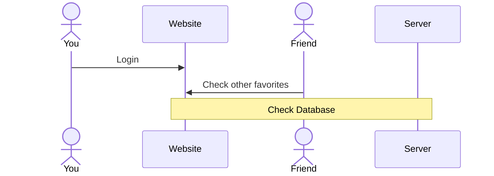

# Soups galore

## Specification Deliverable

For this deliverable I did the following. I checked the box `[x]` and added a description for things I completed.

- [x] Proper use of Markdown
- [x] A concise and compelling elevator pitch
- [x] Description of key features
- [x] Description of how you will use each technology
- [x] One or more rough sketches of your application. Images must be embedded in this file using Markdown image references.

### Elevator pitch

Have you ever feel cold and want to warm something up? Do you struggle with cooking and want some instructions? Well this website is for you!
With multiple recipes for different types of soup, you will be able to find the right one that your stomach is grumbling for. You can even
create a login to save your recipes! The website will feature multiple types of soups that you can choose from!

### Design

Here is how you you can view other's favorites.

### Key features

- Secure login using https
- Display pictures of soup
- Change between different recipes that users can click on
- Check heart to favorite a soup
- Add a favorite section that users can see hearted recipes
- Show ingredients along with instructions on cooking
- A tab to show different world soups

### Technologies

I am going to use the required technologies in the following ways:

- **HTML** - Use HTML as the backbone structure for application. There will be four pages, a login page, home page, world soup page, and profile page.
- **CSS** - Using blue and white color scheme for home page. Incorporate good whitespacing.
- **React** - This will provide logins, favoriting functionality, displaying of soup pictures and proper routing.
- **Service** - Backend service
    - Login
    - Retrieval of favorite choices
    - Links to video instructions
- **DB/Login** - Store users, favorites in database. Register/Login users. Store credentials in database. Need to have account to favorite.
- **WebSocket** - View top favorite recipes of general users.

## 🚀 AWS deliverable

For this deliverable I did the following. I checked the box `[x]` and added a description for things I completed.

- [ ] **Server deployed and accessible with custom domain name** - [My server link](https://yourdomainnamehere.click).

## 🚀 HTML deliverable

For this deliverable I did the following. I checked the box `[x]` and added a description for things I completed.

- [x] **HTML pages** - 5 pages, a home page, account page for login, world page that have 3 sub pages for different continents
- [x] **Proper HTML element usage** - Added the required elements, BODY, NAV, MAIN, HEADER, FOOTER for all pages
- [x] **Links** - All of the links will go to the correct pages, added external links that will open a new tab
- [x] **Text** - Recipes where presented in the appropriate boxes, seperated by font sizes
- [x] **3rd party API placeholder** - This will be on the homepage that will have inpsiring quotes to warm the soup. 3rd 
party API that holds random inspirational/warm quotes
- [x] **Images** - Added images for the respective recipes
- [x] **Login placeholder** - Added this to account page
- [x] **DB data placeholder** - Added to account page, the db will store/retrieve login information
- [x] **WebSocket placeholder** - This will be in account page to ask if the user wants notifications

## 🚀 CSS deliverable

For this deliverable I did the following. I checked the box `[x]` and added a description for things I completed.

- [x] **Header, footer, and main content body** - I added headers that made up the navbar, footer for the copyright credentials, and main content body that has all images and elements center aligned
- [x] **Navigation elements** - Navigation elements are in the navbar and includes a dropdown menu for contents within 'world' tab
- [x] **Responsive to window resizing** - This website can adjust to sizes as small as the Iphone SE with elements and images adjusting automatically
- [x] **Application elements** - There are elements in here that are adjusted to fit the screen but I opted for cleaner look
- [x] **Application text content** - The paragraghs and headers are aligned center for a cleaner asthetic
- [x] **Application images** - Images have been moved to the center and fitted for the screen. Since they all had different sizes, I made
them all fit 50% of the screen and added some bordering to them.

## 🚀 React part 1: Routing deliverable

For this deliverable I did the following. I checked the box `[x]` and added a description for things I completed.

- [x] **Bundled using Vite** - Installed Vite and bundled to run the local apps.
- [x] **Components** - Added a NavDropdown menu for the 'world' section. Added the different pages that users can navigate to within the dropdown box.
- [x] **Router** - All dropdown menu item, navbar items and most pictures will route to a different src page.

## 🚀 React part 2: Reactivity deliverable

For this deliverable I did the following. I checked the box `[x]` and added a description for things I completed.

- [ ] **All functionality implemented or mocked out** - I did not complete this part of the deliverable.
- [ ] **Hooks** - I did not complete this part of the deliverable.

## 🚀 Service deliverable

For this deliverable I did the following. I checked the box `[x]` and added a description for things I completed.

- [x] **Node.js/Express HTTP service** - Created Express HTTP service in index.js that listens on port 4000 and handles all API routes.
- [x] **Static middleware for frontend** - Used express.static('public') middleware to serve frontend React application files.
- [x] **Calls to third party endpoints** - Backend calls 3rd party API ZenQuotes API at /api/quote endpoint to fetch random inspirational quotes that are displayed on the home page.
- [x] **Backend service endpoints** - Created multiple service endpoints including /api/recipes for recipe data, /api/favorites for user favorites management, and /api/auth/* routes for authentication.
- [x] **Frontend calls service endpoints** - Frontend components call endpoints: home.jsx fetches recipes, favorite.jsx manages favorites, all continent pages (asia.jsx, europe.jsx, northAmerica.jsx) add favorites via API, and quotes.jsx retrieves quotes from backend.
- [x] **Supports registration, login, logout, and restricted endpoint** - Implemented full authentication flow with /api/auth/register for new users, /api/auth/login for existing users, /api/auth/logout for session termination, and protected /api/favorites endpoints that require authentication using HTTP-only cookies and middleware.

## 🚀 DB deliverable

For this deliverable I did the following. I checked the box `[x]` and added a description for things I completed.

- [ ] **Stores data in MongoDB** - I did not complete this part of the deliverable.
- [ ] **Stores credentials in MongoDB** - I did not complete this part of the deliverable.

## 🚀 WebSocket deliverable

For this deliverable I did the following. I checked the box `[x]` and added a description for things I completed.

- [ ] **Backend listens for WebSocket connection** - I did not complete this part of the deliverable.
- [ ] **Frontend makes WebSocket connection** - I did not complete this part of the deliverable.
- [ ] **Data sent over WebSocket connection** - I did not complete this part of the deliverable.
- [ ] **WebSocket data displayed** - I did not complete this part of the deliverable.
- [ ] **Application is fully functional** - I did not complete this part of the deliverable.
